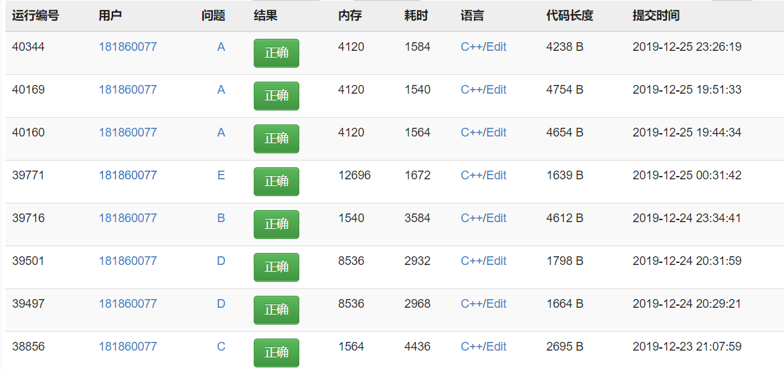

# 数据结构报告

书面报告要求

1. 描述各个模块的数据结构，实现思路，使用方法和细节
2. 给出平均复杂度以及平均空间复杂度
3. 展示运行结果并加以说明

**注明1：这里思路是实现的思路，具体的代码实现操作可以看源代码注释，详细的标注了**

**注明2：由于实验手册和OJ上面的要求有所冲突和不同，OJ是后来发布的并有过修改，就以OJ为准了**

[TOC]

### 模块1

##### 功能要求

手册：给定待查询的收入区间，小蓝鲸需要根据系统内已录入的收入列表，统计该区间内的市民收入平均值，将其平均值取整输出。

OJ：给定n个市⺠的收⼊和m个询问区间[li,ri]。

对于每个询问区间[li,ri]，你的程序需要计算在li到ri范围的收入的平均值，取整后输出。

注意：本题输入输出数据量较大，请使用 scanf 和 printf ，时间复杂度尽量控制在O((n+m)log(n+2m))。

##### 思路

首先是给定数据，然后根据给的区间再计算对应的平均值

计算平均值的本质就是对某段区间的数据统计求和和个数

由于给定的要求的时间和空间复杂度都是log级别的

是肯定不能够先存储数据，然后查询一次计算一次，这种方案的复杂度一定是n的，不符合题意

然后对于log级别的复杂度，第一反应就是树，二分等等。对于这一类的数据和算法大多都有有序的要求。所以需要对排序的算法进行精挑细选。

还有就是不可能给定一次计算一次，这样会有大量的重复计算

所以需要一定的结构去保存一下结果，不能拿每次都算

##### 解决方案

总结以上的描述，最后得到了一个算法

总体的思路就是排序二分前缀和。

具体就是，先拿到所有的数据，然后进希尔排序（log级别的时间复杂度），然后由于给定的数据是工资，很有可能有大量的重复的数据的。

重复的数据会对后续的操作造成影响（尤其是所需区间左右界限的位置的计算会有大量的影响），所以在这里加入一个遍历，然后设置新的数组存放，以及一个等大的数据记录的是每一个数据出现的次数。截至到这里，在存储信息的区间里所有的数据都是独一无二并且有序排好的

在此之后使一次遍历，设置一个新的数组保存前缀和，就是从第一个元素到当前位置的元素之和（考虑到了重复的情况的前缀和）。还有需要一个一样大的数组保存一下所有的数据个数。截至到了这里所有的前期的算法准备都已经完成了，和和个数都已经计算好了。

接下来就是查询计算了，给定了区间，由于存储信息的数组是有序的，所以使用了二分法进行查询，二分法计算出区间左右边界的下标位置。然后这一段区间的所有元素的和就是前缀和数组里对应位置的差。至于个数也同理可以得到，然后的过程就是除一下就行。

##### 复杂度分析

1.时间的复杂度分析

希尔排序 nlogn

前缀和和前缀数量和计算n

查询m次，每一次二分查找上下界logn，计算平均数1

一共就是O（nlogn+mlogn）< O((n+m)log(n+2m))

2.空间复杂度分析

开辟数组存储数据：n

使用数组存储唯一化的数据，存储前缀和，存储前缀数量和：3n

使用若干变量作为计算的中间结果：1

综上所述空间复杂度是：O（n）

##### 运行效果

### 模块二

##### 功能要求

对于n个市民，逐一获取每个市民的年收入。当获取第k个年收入时，统计并输出前k个年收入的中位数。
注：当k为奇数时，直接输出第1大的收入；当k为偶数时，输出+1大的收入的平均值（k≥1）

**注：不允许使用STL，时间复杂度尽量控制在O(nlogn)**

（OJ和手册描述一致）

##### 思路

这个是要求每一次的输入都要输出对应的中位数

那么求解中位数有很多的思路，对于中位数的计算的数据结构，有数组和链表。数组求中位数就要求数组始终是有序的，求中位数这个行为本身很简单，就是下标一半或者是一半左右的两个数的平均值，问题就在于排序上，最优秀的排序就是桶排序，但是空间占用大等等的局限性。如果是使用其他的排序只有插入排序不需要每次都重新排序（新来一个数据，其他的算法要重新再排，插入就是插入就可以了）但是由于数组本身存储结构的局限性导致了插入会有移动的复杂操作。所以数据就很难实现了（虽然在查找中位数上有及其优越的复杂度）。那么就考虑一下链表，链表虽然在插入上非常的没害，搭配上插入排序，简直就是绝配（每一次输入一个数据，插入一个，然后打印出中位数）但是问题在于找中位数不太友好。每一次都要跑半条链子

##### 解决方案

那么很自然的就会寻求新的方案，在充分的考虑了树，线段树，堆之后，有了一个想法。

考虑一下使用两个堆，一个是最大堆一个是最小堆。始终维持两个堆的大小大致是一致的。

对于拿到的数据，先查看一下最小堆是不是空的，如果是空的就直接放入最小堆。如果不是空的，就看看最小堆的堆顶，如果当前的数据比最小堆的堆顶大，那就放到最小堆里，反之放到最大堆里。这个时候数据已经放进去了，这个时候需要保持两个堆的大小大致相等，相差多于1的话从规模较大的堆里退一个出来放到较小的堆里，最后的中位数要么是较大堆的堆顶，或者是两个堆的堆顶的平均值

简单的介绍一下原理，堆有着优越的排序性能（nlogn)，每一个数据也就是执行一次堆的插入的操作，所以在复杂度上是logn的，然后在寻找中位数的时候复杂度几乎可以忽略不计（就是O(1)）的

然后最重要的就是最大堆里放的元素都比最小堆小，也就是最大堆里放了一堆小的元素，堆顶是最大的小元素，最小堆就是相反的。这样的话堆顶就近似是中间的元素了，然后经过处理就可以求出平均数。

##### 复杂度分析

1.时间复杂度分析

可以发现主要的操作就是堆的插入和调整算法，堆的调整操作是logn的（使用数组表示，处理过程都是类似于二分的规模减半），每一次来的新数据都会有常数次的插入和删除，所以应该是O（nlogn）<=  O(nlogn)

2.空间复杂度

使用堆进行存储数据，两个堆的空间大小之和就是总的数据的量：n

使用有限的变量如指针或者是计算的中间结果：1

综上所述空间复杂度应该是O（n）

### 模块三

##### 功能要求

给定n个市民的年收入，以及查询参数k，要求实时反馈出所有收入中最高的k个收入。
收入信息按行给出，每行表示一个市民的年收入。当该行的内容为“Check"字符串时，要求输出到上一条收入为止的所有收入中，最高的k个收入。如果k值超过了当前已经存储的收入数目，则仅需输出已有的数据。输出在一行完成。本题的时间复杂度尽量控制在O(nklogk)以内，鼓励更好的解决方法。 

##### 思路

这个程序的要求就是输出最高的k个，那么和上一个模块很类似，都是需要排序的一个程序

但是同样的遇到了问题，就是一旦check就需要当前序列是有序的，那么就是说check一次就需要排序一次，那么这个复杂度必然不是简单的

所以就是想到说只要有最大的k个就可以了，这样的话问题的规模基数就是k的了

##### 解决方案

直接建立一个k大小的数组，每一次的查询都是在k个数据里进行比较和替换，然后在check的时候打印出结果就行

##### 复杂度分析

1.时间的复杂度分析

每次输入一个数据会进行遍历比较，复杂度O（k）

然后进行数据的迁移，复杂度O（k）

所以最后的复杂度O（nk）< O(nklogk)

2.空间的复杂度分析

仅仅使用了k的大小的数组：k

使用了有限的变量来记录输入数据：1

综上所述空间的复杂度大小：O（k）

### 模块四

##### 功能要求

给定所有蓝鲸市民的身份证号，共n个。市民与身份证号一一对应。身份证号总共有18位，由0~9的数字和大写字母组成。

再给一个市民的身份证号，需要判断这个市民是否属于蓝鲸市。

注：STL中只允许使用string 

##### 解决思路

使用哈希算法进行辅助解决，哈希算法就是利用散列表进行存储，把某种“性质”相似的数据存在一起，这里的是字符串，只要保证哈希算法还不错能够较好的区分开数据的话把数据摊平，然后在查询的时候只要计算出查询的KEY的哈希值然后去找就行

##### 解决方案

使用的是链式散列，考虑到由于可能会有多个数据对应同一个哈希值，所以使用的是链表的散列。然后使用哈希函数计算出来之后先看原来的位置有没有数据，没有就作为头节点，否则就向后插入。查询的时候把查询数据也放入哈希函数计算出位置，然后进行寻找

##### 复杂度分析

1.时间的复杂度分析

理论上来说假若哈希表的大小为M，则复杂度就是O（N/M），对于这次的OJ而言数据的大小是5次方界别的，开一个合适大小的数组（$10^4$），复杂度应该是常数，平均复杂度O（1）

2.空间的复杂度分析

使用了一个定长的数组作为散列表，然后开散列表处理冲突的问题。最坏最坏就是m+n，平均的情况应该是max{n，m}（平均落在散列表里，n比较小的时候是m为大小，如果n较大，也是放满了m之后再开出n-m的空间）综上所述应该是O（max{n，m}）

### 模块五

##### 功能要求

给定N个市民的年收入，要求计算工资最大断档，即对工资排序后相邻两数的差值的最大值。 

算法时间复杂度尽量在O(N)。

##### 思路分析

要求计算出最大的断档，断档其实就是排好序之后相邻数的最大值。但是问题来了，不说别的乱七八糟的，就算是排序，常见的最优秀的排序也是nlogn的。显然是不可能的

如果说连nlogn都不行，那么就只能请出桶排序了，但是这个问题工资的差距可能会特别大（马云的工资和我的工资），差距很大就会导致常规的桶排序会开的特别特别的大，所以还需要对平时用的桶排序进行一点点的改进，桶排序之后最大的断档就是有数据的两端的差值的最大值，这个就是一次n的遍历，没什么好弄的

##### 解决方案

对数据进行一次的遍历，然后计算出最大和最小，然后根据最大最小还有输入的数据的数量设置桶的大小，简单的在这里说一下就是(my_max-my_min)*1.0/(num-1)。这样子就保证了桶的数量最起码不会比数据量大。那么这个时候桶可以说不是普通的离散的桶了，而是一个区间桶，每一个桶里是一个区间的数据，那么还有一个问题就来了，既然是一个棒棒的区间桶，问题只是想要最大断档，其他的具体细节不关心。他不关心那我就不存了。也就是设置两个等大的桶数组，一个数组保存的是当前区间的最大值，另外一个保存的是最小。

接下来的操作就很简单了，每读入一个数据就计算一下下标（所属区间的位置），然后进行比较，看一下有没有必要更新一下当前区间的最大和最小值（如果是处于中间，那就没有必要保存了，一定不会是最大断档的端点）

最后一次遍历求一下最大断档就好，就是相邻的桶的最大和最小的比较，比如说A B 桶，那就B的最小减去A的最大，得到一个断档，遍历得到最大断档就可以了

##### 复杂度分析

1.时间复杂度分析

读入数据的同时计算最大和最小p ，n的复杂度

然后对每一个数据进行计算下标，判断一下桶的位置，并且比较一下时候更新一下值。n的复杂度

最后遍历一次桶，n的复杂度

总而言之的就是n的复杂度

2.空间复杂度分析

使用两个和数据量等大的数据作为最大最小的桶：n

使用有限的数据记录最大最小以及桶大小还有计算的中间数据等数据：1

综上所述空间复杂度应该是O（n）

### 代码正确性检验

