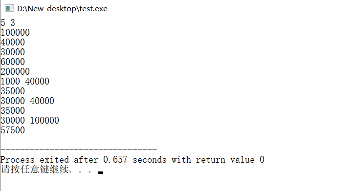
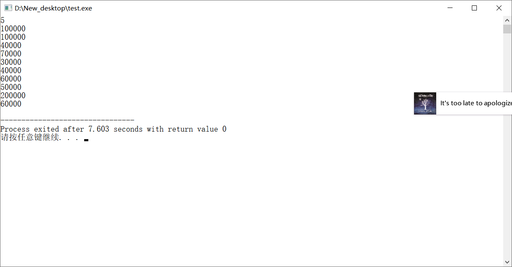
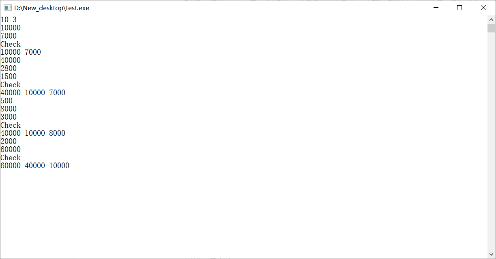
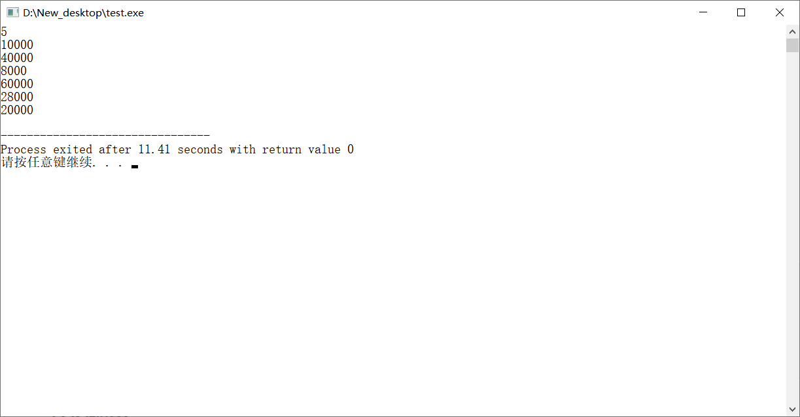

# README

### 简要说明

##### 模块1

模块1承担的功能就是输入一串数据，然后可以计算出区间的平均数

**代码运行方法**

双击运行exe文件（或者是编译运行之后），弹出运行界面之后，输入原始数据的数量，以及想要查询的次数

然后输入数据，接着输入查询区间即可，每一次输入都会快速的计算出正确的结果，如下图所示

##### 模块2

模块2是为了求解一段的中位数，每一次的输入都会输出当前序列的中位数

**代码运行方法**

双击运行exe文件（或者是编译运行之后），弹出运行界面之后，输入想要输入的数据的数量，然后一个一个把数据输入进来就行，每一次输入一个数据都会输出一个中位数的求解的结果，如下图所示

##### 模块3

模块三是为了求解出一段输入的数据里面的高k个数据，也就是最大的那么k个数，如果不够的话就输出有的那么几个数就行

**代码运行方法**

双击运行exe文件（或者是编译运行之后），弹出运行界面之后，输入想要输入的数据的数量，再输入想要查询的数量（说实话没有啥必要输入查询的数量。。。）然后输入数据，中间啥时候想看看计算结果就输入Check一下就行（请务必注意输入的格式，要记得大写）然后程序就会输出当前数据序列的高k个数。如下图所示。

##### 模块4

模块4是为了记录公民的身份证的信息，并且提供查询的接口

**代码运行方法**

双击运行exe文件（或者是编译运行之后），弹出运行界面之后，输入想要输入的数据的数量，然后按照顺序输入所有的数据就可以辣，然后如下图所示就会对查询的数据返回一个查询的结果

##### 模块5

模块5是为了计算输入的一段序列里的最大的断档，换句话说就是按照大小进行排序之后相邻的

**代码运行方法**

双击运行exe文件（或者是编译运行之后），弹出运行界面之后，先进行输入一下想要输入的数据的数量，然后按照顺序进行输入就可以辣，程序就会输出最大的断档。如下图所示

